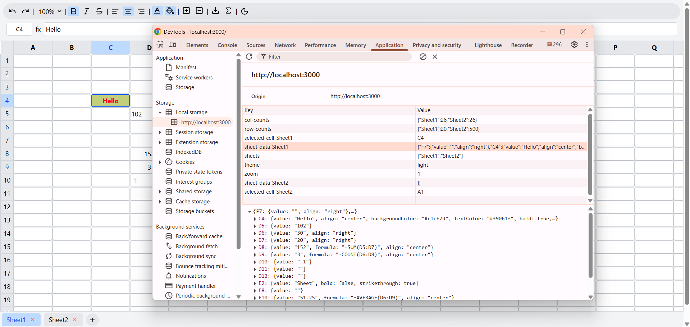

# 🧮 Google Sheets Clone
A fully interactive, web-based spreadsheet application inspired by Google Sheets, built with Next.js, React, and Tailwind CSS. This clone replicates core spreadsheet functionality including multi-sheet support, formula evaluation, and rich cell formatting—all running in the browser with persistent state.

## 🧱 Tech Stack

- Next.js – React Framework (App Router)
- Tailwind CSS – Utility-first styling
- Local state – State management
- localStorage – Data persistence

## ✅ Features

1. Multiple sheets (add, switch between sheets)
2. Spreadsheet grid with resizable rows and columns
3. Cell formatting:  Undo/redo, bold, italic, strikethrough, text alignment, Zoom in/out on the grid and Text and background color for cells
4. Formula bar with support for basic functions: `SUM`, `AVERAGE`, `COUNT`, `MAX`, `MIN`
5. Download sheet data as CSV or JSON
6. Data persistence using localStorage
7. Theme Toggle : Switch between Light and Dark themes.

## ⚙️ Setup Instructions

1. Clone the repo
```bash
git clone https://github.com/dhruv-33/google-sheets.git
cd google-sheets
```

2. Install Dependencies

```bash
npm install
# or
yarn install
```

3. Start the Development Server

```bash
npm run dev
# or
yarn dev
```

- Open [http://localhost:3000](http://localhost:3000) in your browser to use the spreadsheet.

## 🖼️ Screenshots

### 1. Main UI
- Main UI :


### 2. Cell Formats
- Cell Formats :


### 3. Functions :
- Sum Function :


- Average Function :


- Count Function :


- Max Function :


- Min Function :


- Download Function :


### 4. Multiple Sheets
- Multiple Sheets :


### 5. Save Content
- Save Content in Localstorage : 


### 6. Theme
- Dark Theme :


- Light Theme :


## 🙌 Contributions
- Feel free to fork the repo, raise issues, and submit pull requests.

## 🧑‍💻 Usage Tips
- Click any cell to edit its value or formula.
- Use the formula bar to type formulas (e.g., =SUM(B2:B6)).
- Format selected cells using the toolbar.
- Add/remove rows, columns, or entire sheets with ease.
- Export your sheet as .csv or .json.

## 📜 License

This project is for learning and demonstration purposes only.

🚀 Happy Coding! 🎉
